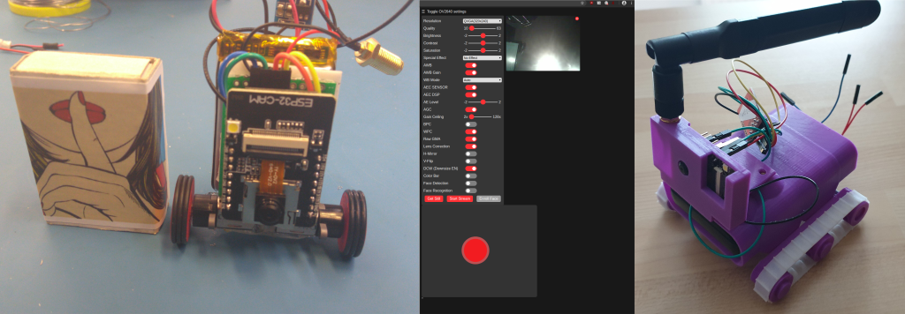
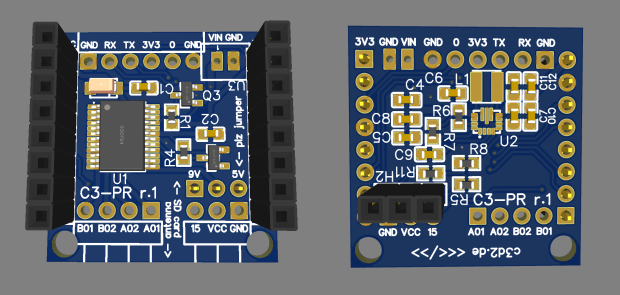
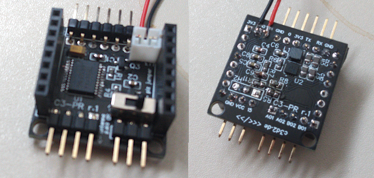
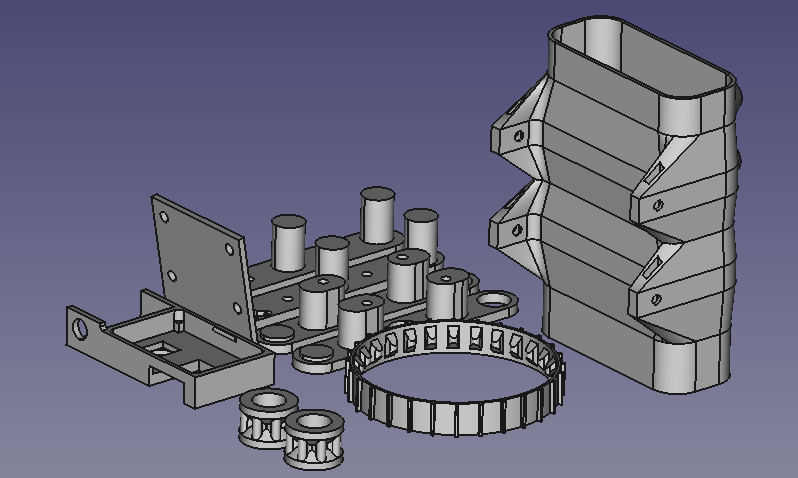

# C3 Presence Robot
A simple and affordable telepresence experimentation platform. Based on the [Espressives ESP32-CAM example revisited](https://github.com/easytarget/esp32-cam-webserver) which in itself is a rework of the ['official' ESP32 Camera example sketch](https://github.com/espressif/arduino-esp32/tree/master/libraries/ESP32/examples/Camera/CameraWebServer) from Espressif.

Construction Howto in German: https://codimd.c3d2.de/c3-pr-tutorial

#### AI-THINKER ESP32-CAM vs Other Modules:

The current design uses the [AI-THINKER ESP32-CAM](https://github.com/raphaelbs/esp32-cam-ai-thinker/blob/master/assets/ESP32-CAM_Product_Specification.pdf) boards. If possible we will keep compatibilty with other modules. 

* For some other good examples and information on ESP32 based webcams I also recommend the sketches here:
https://github.com/raphaelbs/esp32-cam-ai-thinker

* The AI thinker wiki can be quite informative, when run through an online translator and read sensibly:
https://wiki.ai-thinker.com/esp32-cam

#### Motor Driver Hardware

Development of a small motor driver clip-on board is under way. If you want to get started now, wire your own [Dual TB6612FNG](https://www.sparkfun.com/products/14451) motor driver board in a way that AIN2 (BIN2) is the inverted signal of AIN1 (BIN1). We only have so many GPIOs, so we need to use them wisely.

See pcb folder for more information on shematics and gerber files.

* A usefull guide to the ESP32-CAM GPIOs is https://randomnerdtutorials.com/esp32-cam-ai-thinker-pinout/

#### Mechanical Parts

Various designs for mechanical parts are under development.

## Troubleshooting:

Please read this excellent guide for help with common issues of the ESP32-CAM module:
https://randomnerdtutorials.com/esp32-cam-troubleshooting-guide/

## Setup:

* For programming you will need a suitable development environment. We had a lot of fun and 'fun' with the Arduino IDE, but PlatformIO leaves it in the dust. Just check out this repo, set your wifi credentials according to `myconfig.sample.h` and you should be good. However if want to use the Arduino IDE, rename `esp32-cam-webserver.cpp` to `esp32-cam-webserver.ino` in the `src` directory. The Arduino IDE might still work for you. For further instructions and wiring, please refer to the [original repo](https://github.com/easytarget/esp32-cam-webserver).

## Notes: 
* This currently ONLY gets tested with the AI-THINKER modules with OV2640 camera installed. We try to keep the code for other cameras in but this might change in the future.

## Plans
* Improve Wifi, add a captive portal (e.g. [AutoConnect](https://github.com/Hieromon/AutoConnect) for setup.
* Over the air updates.
* Improve motor control and UI, all this is currently very very basic.
* Concurrent access to website and stream doesn't seem to work well (or at all). Fix this.

## References
How to use gamepads in browsers (no external libraries needed, BROWSER DEPENDENT!)
https://gamedevelopment.tutsplus.com/de/tutorials/using-the-html5-gamepad-api-to-add-controller-support-to-browser-games--cms-21345
Differential Steering with Gamepads
https://www.impulseadventure.com/elec/robot-differential-steering.html
